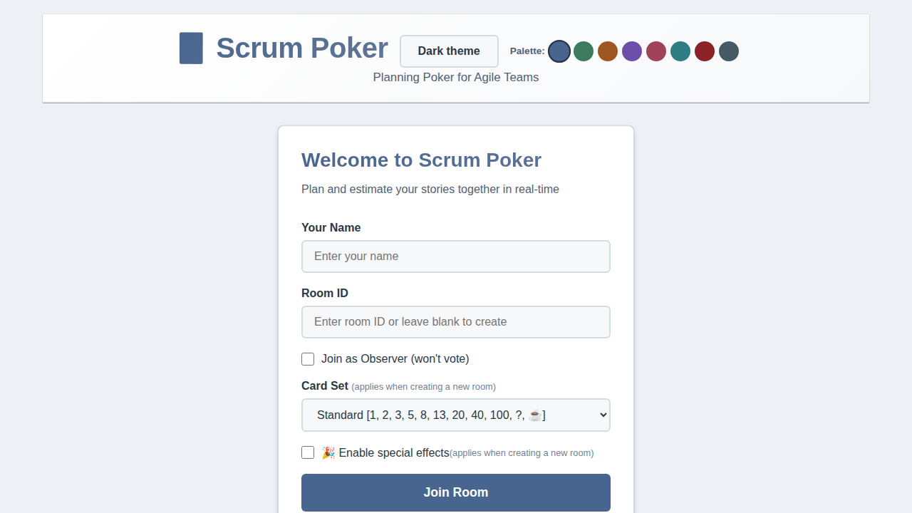
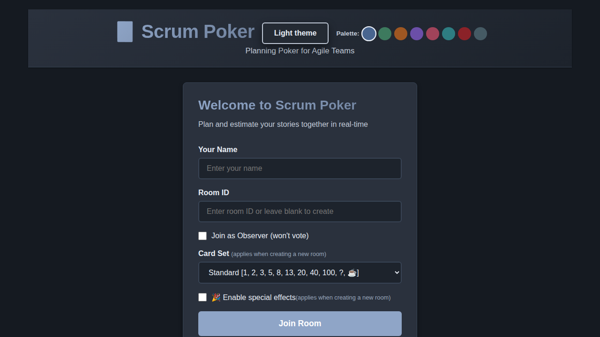
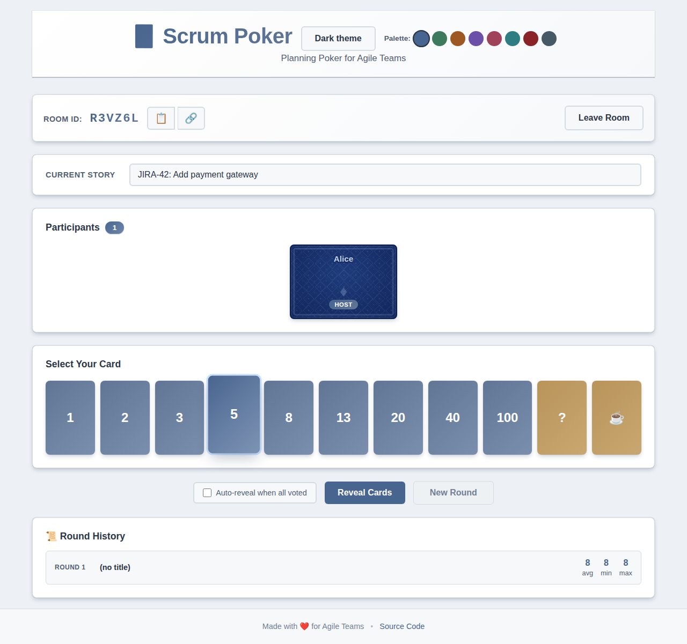
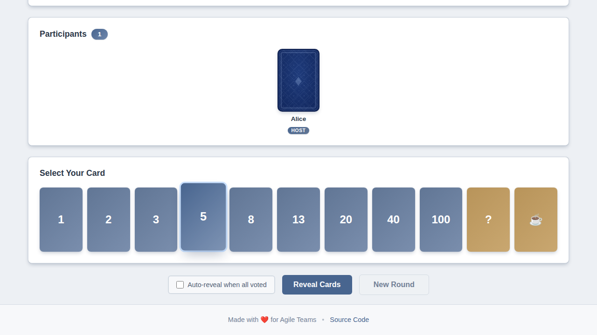
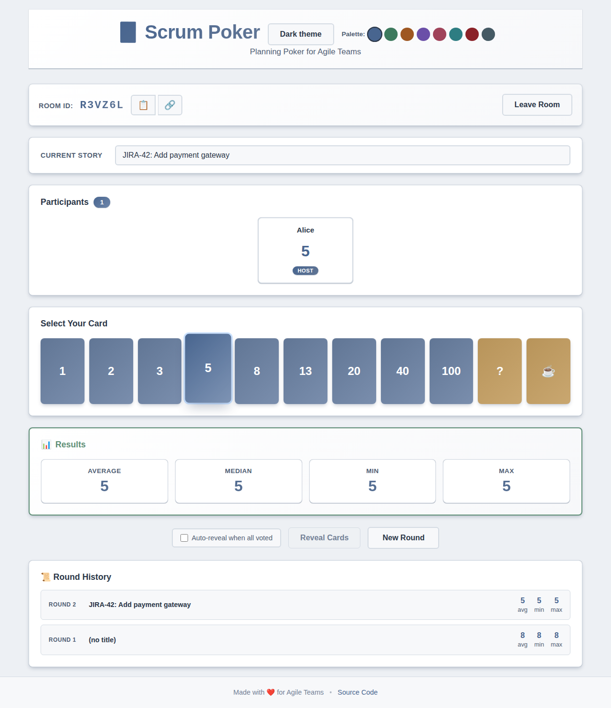

# Scrum Poker App

A real-time networked scrum poker application for agile teams to estimate user stories collaboratively.

## Screenshots

### Welcome Screen (Light Theme)


### Welcome Screen (Dark Theme)


### Voting Room


### Card Selected State


### Revealed Results


## Features

- 🃏 **Real-time Collaboration** - Multiple users can join the same room and vote simultaneously
- 📊 **Instant Results** - See statistics (average, median, min, max) when cards are revealed
- 🎴 **Multiple Card Sets** - Choose from Standard [1-100], Fibonacci, T-Shirt Sizes, or Powers of 2
- 👥 **Observer Mode** - Join as an observer without voting
- 🌓 **Theme Toggle** - Switch between light and dark themes (saved per browser)
- 🎨 **Color Palettes** - 8 built-in color palettes (Ocean, Forest, Sunset, Violet, Rose, Teal, Crimson, Slate)
- 📝 **Story Title** - Host can label each round with a story title or ticket number
- ⚡ **Auto-reveal** - Optionally reveal cards automatically once every voter has voted
- 🎉 **Special Effects** - Optional confetti, fireworks, and sound effects when the team reaches consensus
- 📜 **Round History** - Session log of past rounds shown after each reveal
- 🔗 **Shareable URL** - Room link auto-updates with `?room=` so you can share it directly from the address bar
- 📘 **Estimation Help Section** - In-app guidance on usage, Fibonacci sizing, and story points
- 👑 **Host Controls** - Room creator can reveal/reset rounds and remove participants
- 🔄 **Reconnect Grace Period** - Page refreshes preserve your vote and room membership
- 🏠 **Host Takeover** - If the host is absent for over a minute, remaining participants are offered the option to become the new host
- 📱 **Responsive Design** - Works on desktop, tablet, and mobile devices
- 🔒 **Room-based Sessions** - Private rooms with unique IDs for team privacy
- 🔌 **WebSocket Communication** - Fast, real-time updates using Socket.IO

## Card Values

Choose from four card sets when creating a room:

| Card Set | Values |
|---|---|
| **Standard** *(default)* | 1, 2, 3, 5, 8, 13, 20, 40, 100, ? |
| **Fibonacci** | 0, ½, 1, 2, 3, 5, 8, 13, 21, 34, 55, ?, ☕ |
| **T-Shirt Sizes** | XS, S, M, L, XL, XXL, ? |
| **Powers of 2** | 1, 2, 4, 8, 16, 32, 64, ? |

The card set is chosen by the room creator at join time and applies to all participants in the room.

## Local Development

### Prerequisites

- Node.js 18 or higher
- npm

### Installation

1. Clone the repository:
```bash
git clone https://github.com/agornovo/scrumpoker.git
cd scrumpoker
```

2. Install dependencies:
```bash
npm install
```

3. Start the server:
```bash
npm start
```

4. Open your browser and navigate to:
```
http://localhost:8080
```

## Testing

The project includes comprehensive test coverage with both unit tests and end-to-end tests.

### Running Tests

Run all tests (unit + E2E):
```bash
npm test
```

Run only unit tests:
```bash
npm run test:unit
```

Run only E2E tests:
```bash
npm run test:e2e
```

Run unit tests in watch mode (for development):
```bash
npm run test:unit:watch
```

Run E2E tests with UI (for debugging):
```bash
npm run test:e2e:ui
```

Run E2E tests in headed mode (see the browser):
```bash
npm run test:e2e:headed
```

### Test Coverage

Unit tests cover:
- Health check endpoints
- Room management (create, join, cleanup)
- Voting functionality
- Real-time statistics calculation
- Vote reveal and reset operations
- Multi-user collaboration
- Observer mode
- Card set selection and room-level broadcasting

E2E tests cover:
- Joining rooms and user authentication
- Card set selection (Standard, Fibonacci, T-Shirt, Powers of 2)
- Card selection and deselection
- Voting workflow
- Real-time updates across multiple users
- Reveal cards and statistics display
- New round/reset functionality
- Observer mode behavior
- Copy room ID functionality
- Room creator card set shared with all participants

### Continuous Integration

The project uses GitHub Actions for CI/CD. Two parallel jobs run on every push and pull request:

**`test` job** (Node.js matrix: 18.x, 20.x, 24.x)
- Unit tests with coverage reporting
- E2E tests with Playwright against `node server.js`

**`docker-e2e` job**
- Builds the production Docker image
- Starts the container with short reconnect timeouts for test speed
- Runs the full Playwright E2E test suite against the running Docker container
- Uploads the Playwright HTML report as a CI artifact

CI runs automatically on:
- Push to main/master branches
- Pull requests to main/master branches

## Deployment

### Docker

Build the Docker image:
```bash
docker build -t scrumpoker .
```

Run the container:
```bash
docker run -p 8080:8080 scrumpoker
```

### OpenShift

Deploy to OpenShift using the provided configuration:

```bash
# Build and push your image to a registry accessible by OpenShift
docker build -t your-registry/scrumpoker:latest .
docker push your-registry/scrumpoker:latest

# Update the image in openshift-deployment.yaml, then apply:
oc apply -f openshift-deployment.yaml
```

The deployment includes:
- Health check endpoints (`/health` and `/ready`)
- Automatic TLS/HTTPS termination
- Liveness and readiness probes
- Service and Route configuration

## How to Use

1. **Create or Join a Room**
   - Enter your name
   - Either enter an existing Room ID or leave blank to create a new one
   - Optionally check "Join as Observer" to watch without voting
   - Select a **Card Set** (Standard, Fibonacci, T-Shirt Sizes, or Powers of 2) — applies when creating a new room
   - Optionally enable **Special Effects** (confetti, fireworks, and sounds on consensus) — applies when creating a new room
   - Click "Join Room"

2. **Share the Room**
   - Share the Room ID with your team members
   - Use the copy button (📋) for easy sharing
   - Use the link button (🔗) to copy a direct shareable URL

3. **Set the Story (Host only)**
   - Type a story title or ticket number in the **Current Story** field
   - The title is broadcast to all participants in real time

4. **Vote**
   - Select a card that represents your estimate
   - Your vote is hidden from others until revealed
   - A checkmark (✓) shows who has voted
   - Enable **Auto-reveal** to automatically reveal when every voter has voted

5. **Reveal Cards**
   - The room host clicks "Reveal Cards" after everyone has voted
   - All votes are shown simultaneously
   - Statistics (average, median, min, max) are calculated automatically

6. **Start New Round**
   - The room host clicks "New Round" to reset all votes
   - The completed round is added to the **Round History**
   - Keep the same room and participants

7. **Use Estimation Guidance**
   - Open the help section on the welcome screen
   - Review guidance on Scrum Poker purpose, Fibonacci sizing, and story points

8. **Personalize the UI**
   - Switch between **Light** and **Dark** themes
   - Choose one of 8 **Color Palettes** (Ocean, Forest, Sunset, Violet, Rose, Teal, Crimson, Slate)

## Architecture

- **Backend**: Node.js + Express + Socket.IO
- **Frontend**: Vanilla JavaScript (no frameworks)
- **Communication**: WebSocket for real-time updates
- **Deployment**: Docker + OpenShift compatible

## Configuration

The app uses environment variables for configuration:

- `PORT` - Server port (default: 8080)

## License

This project is licensed under the GPL-3.0 License - see the LICENSE file for details.

## Contributing

Contributions are welcome! Please feel free to submit a Pull Request.
